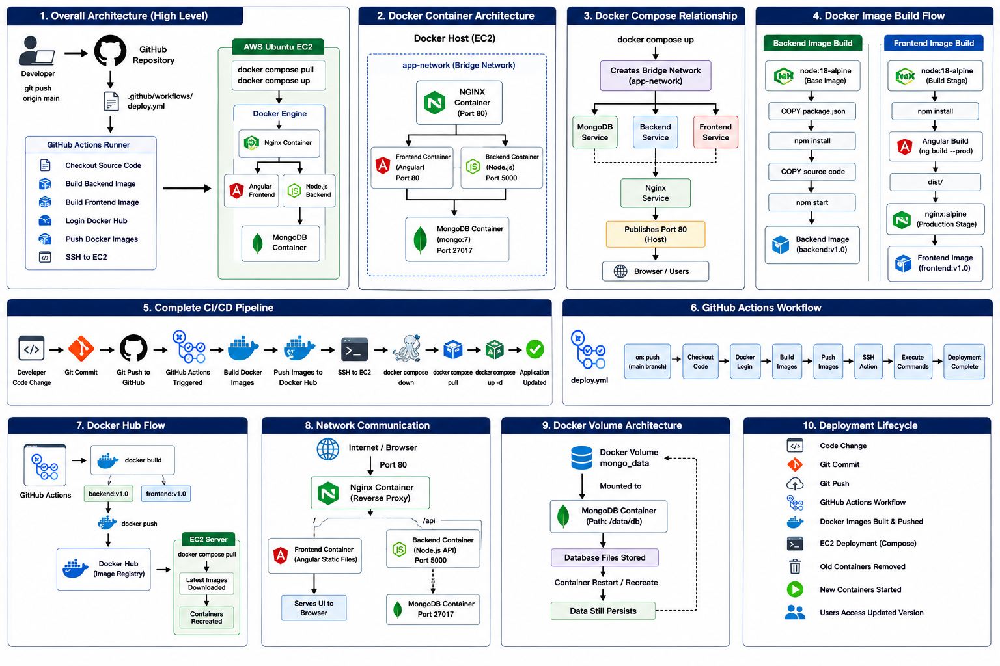

# 🚀 MEAN Stack DevOps Deployment

> Production-style deployment of a **MEAN** (MongoDB, Express.js, Angular, Node.js) application using **Docker, Docker Compose, Nginx, GitHub Actions, Docker Hub, and AWS EC2** — with a fully automated CI/CD pipeline.

<p align="left">
  
  
  
  
  
</p>

---

## 📑 Table of Contents

1. [Project Overview](#-project-overview)
2. [Technology Stack](#-technology-stack)
3. [Architecture](#-architecture)
4. [Project Structure](#-project-structure)
5. [Prerequisites](#-prerequisites)
6. [Infrastructure](#-infrastructure)
7. [Getting Started](#-getting-started)
8. [Docker Containerization](#-docker-containerization)
9. [Pushing Images to Docker Hub](#-pushing-images-to-docker-hub)
10. [Docker Compose Deployment](#-docker-compose-deployment)
11. [Nginx Reverse Proxy](#-nginx-reverse-proxy)
12. [CI/CD Pipeline](#-cicd-pipeline)
13. [GitHub Secrets Configuration](#-github-secrets-configuration)
14. [Continuous Deployment Flow](#-continuous-deployment-flow)
15. [Deployment Verification](#-deployment-verification)
16. [Useful Docker Commands](#-useful-docker-commands)
17. [Lightweight Redeployment (No Repo Clone)](#-lightweight-redeployment-no-repo-clone)
18. [Roadmap](#-roadmap)
19. [Author](#-author)

---

## 📌 Project Overview

This repository demonstrates an end-to-end **DevOps implementation** for deploying a full-stack **MEAN** application using containerization, CI/CD automation, and cloud infrastructure on AWS.

Every push to the `main` branch triggers an automated pipeline that builds fresh Docker images, publishes them to Docker Hub, connects to the production EC2 instance over SSH, and restarts the running containers — with **zero manual intervention**.

**Highlights**

- 🔁 Fully automated build → push → deploy pipeline via GitHub Actions
- 🐳 Multi-stage Docker builds for a lean, production-ready frontend image
- 🌐 Nginx as a single public entry point, reverse-proxying frontend and API traffic
- ☁️ Reproducible infrastructure on a right-sized AWS EC2 instance
- 📦 Stateless redeployment — only `docker-compose.yml` and `nginx/default.conf` are needed on the host

---

## ✨ Technology Stack

| Layer                    | Technology            |
|---------------------------|------------------------|
| Frontend                  | Angular                |
| Backend                   | Node.js + Express.js   |
| Database                  | MongoDB                |
| Reverse Proxy             | Nginx                  |
| Container Runtime         | Docker                 |
| Container Orchestration   | Docker Compose         |
| Container Registry        | Docker Hub             |
| CI/CD                     | GitHub Actions         |
| Source Control            | Git / GitHub           |
| Cloud Platform             | AWS EC2 (Ubuntu 22.04) |

---

## 🏗 Architecture



**Request flow:** Client → Nginx (port 80) → Angular static assets *or* proxied `/api` calls → Express backend → MongoDB.

**Deployment flow:** Developer push → GitHub Actions → Docker Hub → EC2 (pull + restart).

---

## 📂 Project Structure

```text
crud-dd-task-mean-app
│
├── backend/
│   ├── app/
│   ├── Dockerfile
│   ├── package.json
│   └── server.js
│
├── frontend/
│   ├── Dockerfile
│   ├── angular.json
│   ├── package.json
│   └── src/
│
├── nginx/
│   └── default.conf
│
├── docker-compose.yml
│
├── .github/
│   └── workflows/
│       └── docker-build.yml
│
└── README.md
```

---

## ✅ Prerequisites

Before you begin, make sure you have:

- A GitHub account with permission to fork/clone this repository
- A Docker Hub account
- An AWS account with permission to launch EC2 instances
- An SSH key pair for EC2 access
- Git installed locally

---

## ☁ Infrastructure

The application is hosted on a single **AWS EC2 Ubuntu instance**.

| Parameter          | Value        |
|---------------------|--------------|
| Instance Type        | t3.medium    |
| vCPU                 | 2            |
| Memory                | 4 GB         |
| Storage               | 20 GB EBS    |
| Operating System       | Ubuntu 22.04 |

**Why `t3.medium`?**
It provides sufficient headroom to run Docker Engine, Docker Compose, MongoDB, the Angular frontend, the Node.js backend, and Nginx concurrently without resource contention.

**Security Group — required inbound rules**

| Port | Purpose |
|------|---------|
| 22   | SSH     |
| 80   | HTTP    |

---

## 🚀 Getting Started

### 1. Launch the AWS EC2 instance

Provision an Ubuntu 22.04 instance (`t3.medium`, 20 GB EBS) with the security group rules above.

### 2. Connect to the instance

```bash
ssh -i mykey.pem ubuntu@<EC2-Public-IP>
```
### 3. Fork and clone the repository

```bash
git clone https://github.com/<your-github-username>/<repository-name>.git
cd <repository-name>
```

### 4. Update the server and install Docker

```bash
sudo apt update && sudo apt upgrade -y

sudo apt install docker.io -y
sudo systemctl enable docker
sudo systemctl start docker
docker --version
```

### 5. Install Docker Compose

```bash
sudo apt install docker-compose -y
docker compose version
```

### 6. Configure Git (local machine)

```bash
git config --global user.name "<your-name>"
git config --global user.email "<your-email>"
```

---

## 🐳 Docker Containerization

The application is split into independently built and deployed images:

| Image     | Purpose              |
|------------|-----------------------|
| Backend    | Express REST API      |
| Frontend   | Angular application    |
| MongoDB    | Database (official image) |
| Nginx      | Reverse proxy          |

### Backend image

```bash
docker build -t <dockerhub-username>/backend:v1.0 ./backend
```

Installs Node.js dependencies, starts the Express server, and exposes the backend port.

### Frontend image (multi-stage build)

```bash
docker build -t <dockerhub-username>/frontend:v1.0 ./frontend
```

| Stage | Responsibility |
|-------|-----------------|
| 1 — Build   | Compile the Angular application |
| 2 — Serve   | Serve the compiled static assets via Nginx |

A multi-stage build keeps the final image small by excluding Node.js build tooling from the runtime layer.

---

## 📦 Pushing Images to Docker Hub

```bash
docker login

docker push <dockerhub-username>/backend:v1.0
docker push <dockerhub-username>/frontend:v1.0
```

---

## 🐳 Docker Compose Deployment

All services are orchestrated together via Docker Compose:

| Service   | Description     |
|------------|-------------------|
| MongoDB    | Database           |
| Backend    | Express API         |
| Frontend   | Angular UI (served via Nginx) |
| Nginx      | Reverse proxy / public entry point |

**Deploy:**

```bash
docker compose up -d
```

**Verify running containers:**

```bash
docker ps
```

Expected containers: `mongodb`, `backend`, `frontend`, `nginx`.

---

## 🌐 Nginx Reverse Proxy

Nginx is the single public entry point for the application.

- Config file: `nginx/default.conf`
- Serves the compiled Angular application
- Routes `/api` requests to the backend service
- Listens on port `80`

**Application URL:**

```text
http://<EC2-PUBLIC-IP>
```

---

## ⚙ CI/CD Pipeline

Workflow file: `.github/workflows/docker-build.yml`

```text
Developer
   │
   ▼
Git Push (main)
   │
   ▼
GitHub Actions
   │
   ├── Checkout repository
   ├── Build Docker images (backend + frontend)
   ├── Log in to Docker Hub
   ├── Push images to Docker Hub
   ├── SSH into EC2
   ├── Pull latest images
   └── Restart containers (docker compose up -d)
```

---

## 🔐 GitHub Secrets Configuration

Navigate to **Repository → Settings → Secrets and variables → Actions**, and add:

| Secret             | Description             |
|---------------------|---------------------------|
| `DOCKER_USERNAME`   | Docker Hub username        |
| `DOCKER_PASSWORD`   | Docker Hub password / access token |
| `VM_HOST`            | EC2 public IP              |
| `VM_USER`            | SSH username (e.g. `ubuntu`) |
| `VM_SSH_KEY`         | Private SSH key for EC2 access |

> 🔒 Use a Docker Hub **access token** instead of your raw password wherever possible.

---

## 🔄 Continuous Deployment Flow

Every push to `main` triggers a full redeploy — no manual steps required:

```bash
git add .
git commit -m "Application update"
git push origin main
```

GitHub Actions automatically:

1. Builds fresh Docker images
2. Pushes them to Docker Hub
3. Connects to EC2 over SSH
4. Pulls the latest images
5. Restarts the Docker containers

---

## 📊 Deployment Verification

Open the application in a browser:

```text
http://<EC2-PUBLIC-IP>
```

**Expected result:**

- ✅ Angular application loads
- ✅ Backend API is reachable
- ✅ MongoDB persists application data

---

## 🧪 Useful Docker Commands

```bash
# Check running containers
docker ps

# View logs
docker logs backend
docker logs frontend
docker logs nginx

# Restart the application
docker compose up -d

# Stop the application
docker compose down

# List local images
docker images
```

---

## 📝 Lightweight Redeployment (No Repo Clone)

If the Docker images already exist on **Docker Hub**, there is no need to clone the full repository onto the host VM. Only two files are required:

```text
/home/ubuntu/<repository-name>/
│
├── docker-compose.yml
└── nginx/
    └── default.conf
```

| File                    | Purpose |
|--------------------------|---------|
| `docker-compose.yml`     | Defines all application services and container configuration |
| `nginx/default.conf`      | Mounted into the Nginx container as a bind volume; drives reverse-proxy behavior |

---

## 🚀 Roadmap

- [ ] Kubernetes deployment
- [ ] HTTPS via Let's Encrypt SSL
- [ ] Custom domain integration
- [ ] Monitoring with Prometheus & Grafana
- [ ] Centralized logging with the ELK stack
- [ ] Infrastructure as Code with Terraform
- [ ] Automated backup and restore
- [ ] Blue-green deployment strategy

⭐ If you found this project useful, consider giving the repository a **star**.
